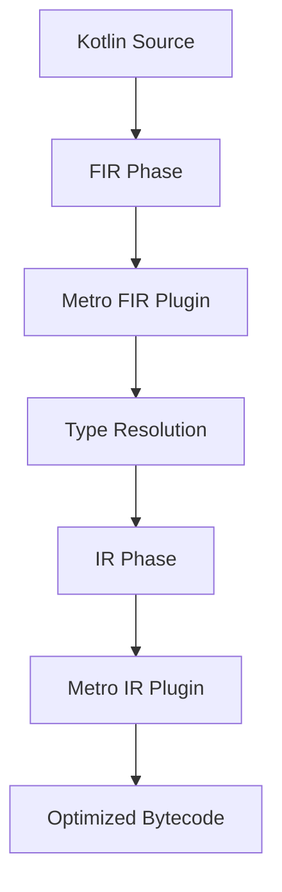
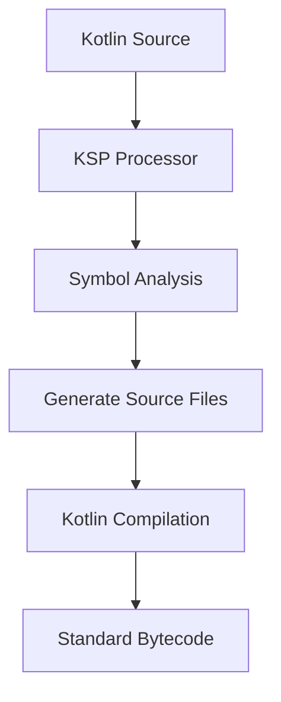

At their core, Metro and Hilt represent two fundamentally different approaches to dependency injection code generation:

- **Metro**: Kotlin compiler plugin operating at FIR (Frontend Intermediate Representation) and IR (Intermediate Representation) phases
- **Hilt**: KSP (Kotlin Symbol Processing) annotation processor generating source code

This architectural choice cascades into every aspect of how these frameworks operate.

### Metro's Compiler Plugin Architecture

#### FIR Phase: Early Intervention

Metro hooks into the Kotlin compiler's FIR phase, allowing it to modify the compilation process before type resolution:

```kotlin
// What you write
@Inject
class HttpClient(
    private val okHttp: OkHttpClient,
    private val logger: Logger
)

// Metro sees this in FIR and can:
// 1. Validate dependencies exist
// 2. Generate synthetic properties
// 3. Modify type resolution
```

#### IR Phase: Direct Bytecode Generation

In the IR phase, Metro generates actual implementation code directly:

```kotlin
// Metro generates this in IR (pseudocode representation)
class HttpClient_Factory : Factory<HttpClient> {
    private val okHttpProvider: Provider<OkHttpClient>
    private val loggerProvider: Provider<Logger>

    constructor(graph: DependencyGraph) {
        // Direct field access - no reflection!
        this.okHttpProvider = graph.okHttpClientProvider
        this.loggerProvider = graph.loggerProvider
    }

    override fun get(): HttpClient {
        // Direct instantiation - no overhead!
        return HttpClient(
            okHttpProvider.get(),
            loggerProvider.get()
        )
    }
}
```

#### The Power of Compiler Integration

Metro can do things impossible with annotation processing:

```kotlin
// Top-level function injection - Metro generates a wrapper class
@Inject
fun App(database: Database, api: ApiClient) {
    // Your app logic
}

// Metro generates in FIR:
@Inject
class AppClass(
    private val database: Provider<Database>,
    private val api: Provider<ApiClient>
) {
    operator fun invoke() {
        App(database.get(), api.get())
    }
}
```

### Hilt's KSP Architecture

#### Symbol Processing: Working with AST

Hilt uses KSP to analyze your code's Abstract Syntax Tree (AST) and generate new source files:

```kotlin
// What you write
@AndroidEntryPoint
class MainActivity : AppCompatActivity() {
    @Inject lateinit var repository: UserRepository
}

// Hilt's KSP processor generates (simplified):
abstract class Hilt_MainActivity : AppCompatActivity() {
    private fun inject() {
        (applicationContext as GeneratedComponent)
            .mainActivityComponentBuilder()
            .activity(this)
            .build()
            .inject(this as MainActivity)
    }

    override fun onCreate(savedInstanceState: Bundle?) {
        inject() // Must happen before super.onCreate()
        super.onCreate(savedInstanceState)
    }
}
```

#### Component Hierarchy Management

Hilt generates a complex component hierarchy at compile-time:

```kotlin
// Generated by Hilt KSP
@Component(modules = [ApplicationModule::class])
@Singleton
interface DaggerApplicationComponent : ApplicationComponent {

    @Component.Builder
    interface Builder {
        fun applicationContext(@BindsInstance context: Context): Builder
        fun build(): ApplicationComponent
    }

    // Subcomponent factories
    fun activityComponentFactory(): ActivityComponent.Factory
    fun fragmentComponentFactory(): FragmentComponent.Factory

    // Injection methods
    fun inject(application: MyApplication)
}

// Activity-scoped component
@Subcomponent(modules = [ActivityModule::class])
@ActivityScoped
interface ActivityComponent {
    @Subcomponent.Factory
    interface Factory {
        fun create(@BindsInstance activity: Activity): ActivityComponent
    }

    fun inject(activity: MainActivity)
}
```

### Compilation Process Comparison

#### Metro's Compilation Pipeline



Metro operates in two phases:

1. **FIR Phase**: Analyzes and modifies declarations
2. **IR Phase**: Generates implementation code

```kotlin
// Metro's FIR phase work
class MetroFirExtension : FirDeclarationGenerationExtension() {
    override fun generateFunctions(
        callableId: CallableId,
        context: MemberGenerationContext
    ): List<FirNamedFunctionSymbol> {
        // Generate factory functions for @Inject classes
        if (callableId.isInjectFactory()) {
            return listOf(generateFactoryFunction(callableId))
        }
        return emptyList()
    }
}

// Metro's IR phase work
class MetroIrGeneration : IrGenerationExtension {
    override fun generate(
        moduleFragment: IrModuleFragment,
        pluginContext: IrPluginContext
    ) {
        // Generate actual factory implementations
        moduleFragment.files.forEach { file ->
            file.declarations.forEach { declaration ->
                if (declaration.hasInjectAnnotation()) {
                    generateFactory(declaration, pluginContext)
                }
            }
        }
    }
}
```

#### Hilt's KSP Pipeline



Hilt's process is more traditional:

```kotlin
// Hilt's KSP Processor
class HiltSymbolProcessor(
    private val environment: SymbolProcessorEnvironment
) : SymbolProcessor {

    override fun process(resolver: Resolver): List<KSAnnotated> {
        // Find all @Inject annotated elements
        val injectables = resolver
            .getSymbolsWithAnnotation("javax.inject.Inject")
            .filterIsInstance<KSClassDeclaration>()

        injectables.forEach { injectable ->
            // Generate factory class
            generateFactory(injectable)
            // Generate module if needed
            generateModule(injectable)
            // Update component interface
            updateComponent(injectable)
        }

        return emptyList()
    }

    private fun generateFactory(classDecl: KSClassDeclaration) {
        val factoryClass = """
            class ${classDecl.simpleName}_Factory : Factory<${classDecl.simpleName}> {
                @Inject constructor(
                    ${generateConstructorParams(classDecl)}
                )

                override fun get(): ${classDecl.simpleName} {
                    return ${classDecl.simpleName}(
                        ${generateArguments(classDecl)}
                    )
                }
            }
        """.trimIndent()

        // Write to file
        environment.codeGenerator.createNewFile(
            dependencies = Dependencies(false, classDecl.containingFile!!),
            packageName = classDecl.packageName,
            fileName = "${classDecl.simpleName}_Factory"
        ).write(factoryClass.toByteArray())
    }
}
```

### Runtime Performance Characteristics

#### Metro: Zero-Overhead Abstraction

Metro's generated code has virtually no runtime overhead:

```kotlin
// Your code
val repository = graph.userRepository

// Metro generates (actual IR, represented as Kotlin)
class MetroGraph : AppGraph {
    // Direct field storage - no map lookups!
    private val _userRepository: UserRepository by lazy {
        UserRepository(
            userDao = database.userDao(),
            apiClient = retrofit.create()
        )
    }

    override val userRepository: UserRepository
        get() = _userRepository
}
```

**Performance characteristics:**
- Direct field access
- No reflection
- No map lookups
- Compile-time wiring means no runtime discovery

#### Hilt: Component Management Overhead

Hilt has some runtime overhead due to component management:

```kotlin
// Runtime component creation
class MainActivity : AppCompatActivity() {
    @Inject lateinit var repository: UserRepository

    override fun onCreate(savedInstanceState: Bundle?) {
        // Runtime component building
        val component = (application as HiltApplication)
            .getApplicationComponent()
            .activityComponentBuilder()
            .activity(this)
            .build()

        // Runtime injection via reflection or generated code
        component.inject(this)

        super.onCreate(savedInstanceState)
    }
}
```

**Performance characteristics:**
- Component creation at runtime
- Some reflection for member injection (mitigated by code generation)
- Map lookups for scoped instances
- Runtime validation of component hierarchy

### Advanced Features Comparison

#### Metro's Compile-Time Graph Validation

Metro validates the entire dependency graph at compile-time:

```kotlin
// This fails at COMPILE TIME if Logger is missing
@DependencyGraph
interface AppGraph {
    val httpClient: HttpClient // Requires Logger
}

// Metro's compiler plugin checks:
// 1. All dependencies resolvable
// 2. No circular dependencies
// 3. Scope compatibility
// 4. Qualifier matching
```

#### Hilt's Runtime Component Scoping

Hilt manages Android lifecycle scopes at runtime:

```kotlin
@Module
@InstallIn(SingletonComponent::class)
object AppModule {
    @Provides
    @Singleton // Checked at runtime
    fun provideDatabase(@ApplicationContext context: Context): Database {
        return Room.databaseBuilder(context, Database::class.java, "app.db")
            .build()
    }
}

@Module
@InstallIn(ActivityComponent::class)
object ActivityModule {
    @Provides
    @ActivityScoped // Managed at runtime
    fun provideAnalytics(activity: Activity): Analytics {
        return Analytics(activity)
    }
}
```

### Generic Support and Type Safety

#### Metro: Full Generic Support via Compiler

```kotlin
// Metro handles generics perfectly due to compiler integration
@Inject
class Repository<T : Entity>(
    private val dao: Dao<T>,
    private val mapper: Mapper<T>
)

// Metro generates type-safe factories
class Repository_Factory<T : Entity> : Factory<Repository<T>> {
    // Fully type-safe, no type erasure issues!
}
```

#### Hilt: Limited by Type Erasure

```kotlin
// Hilt struggles with generics due to KSP limitations
@Inject
class Repository<T>(
    private val dao: Dao<T> // Warning: Type parameter T is erased
)

// Requires workarounds like:
@Inject
class UserRepository(
    private val dao: Dao<User> // Concrete type required
)
```

### Incremental Compilation

#### Metro: Granular Invalidation

Metro tracks dependencies at the declaration level:

```kotlin
// Change to HttpClient only recompiles dependents
@Inject
class HttpClient(...) // Changed

// Only these recompile:
class ApiService(httpClient: HttpClient) // Recompiled
class Database(...) // Not recompiled
```

#### Hilt: Module-Level Invalidation

Hilt/KSP typically invalidates at the module level:

```kotlin
@Module
object NetworkModule {
    @Provides
    fun provideHttpClient(...) // Changed

    @Provides
    fun provideGson() // Also reprocessed even if unchanged
}
```

### Debugging Experience

#### Metro: Integrated Debugging

```kotlin
// metro DSL in build.gradle
metro {
    debug.set(true) // Prints IR pseudocode

    // See exactly what's generated
    debugFilter.set(".*Factory")
}
```

#### Hilt: Source File Inspection

With Hilt, you can inspect generated source files:

```kotlin
// Check build/generated/ksp/debug/java/...
// Actual Java/Kotlin source files you can read and debug
```

### Conclusion: Architectural Trade-offs

#### Metro Advantages:
- **Zero runtime overhead** - Direct field access, no reflection
- **Superior compile-time validation** - Catches all DI errors at compile time
- **Better generic support** - Full type information available
- **More efficient generated code** - Direct bytecode generation
- **Advanced features** - Top-level function injection, context receivers

#### Metro Disadvantages:
- **Requires compiler plugin** - More complex build setup
- **Limited IDE support** - Red code without proper plugin support
- **Harder to debug** - IR generation vs source files
- **Less mature ecosystem** - Fewer third-party integrations

#### Hilt Advantages:
- **Mature ecosystem** - Battle-tested, extensive documentation
- **Android integration** - First-class Android lifecycle support
- **Easier debugging** - Generated source files are readable
- **IDE support** - Full IDE support out of the box
- **Gradual migration** - Can coexist with Dagger

#### Hilt Disadvantages:
- **Runtime overhead** - Component creation and management
- **Limited by KSP** - Type erasure, no compiler modifications
- **More boilerplate** - Components, modules, installation
- **Android-specific** - Tied to Android framework

The choice between Metro and Hilt ultimately depends on your priorities: Metro for maximum performance and compile-time safety, Hilt for ecosystem maturity and Android-specific features. Metro represents the future of Kotlin DI with its compiler-plugin approach, while Hilt provides the stability and integration needed for production Android applications today.